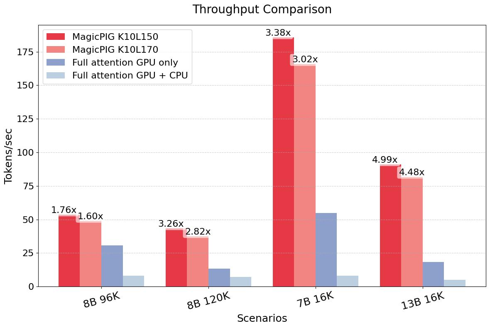
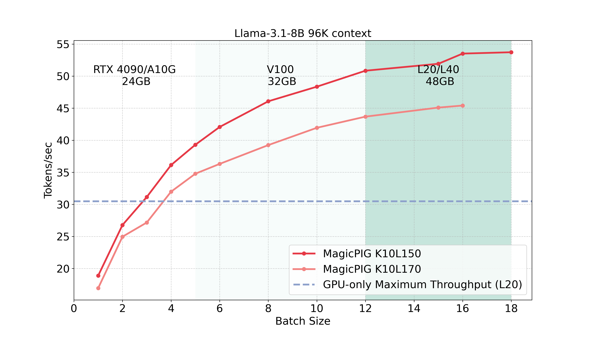

<div align="center">
<h1> MagicPIG-v0.2: LSH sampling<br>for Efficient LLM Generation
</h1>

Zhuoming Chen, Ranajoy Sadhukhan, Zihao Ye, Yang Zhou, Jianyu Zhang, Niklas Nolte, Yuandong Tian, Matthijs Douze, Leon Bottou, Zhihao Jia, Beidi Chen

For exploring the possibility of **GPU-CPU** system powered by Locality-Sensitive-Hashing.
</div>

<div align="center">
[<a href="https://arxiv.org/abs/2410.16179">Paper</a>] | [<a href="www.lsh-ai.com">Blog</a>]
</div>
<br>


## Updates
Compared with the initial release, we upgrade the followings to achieve much higher throughputs.

- Use FlashInfer to compute the GPU attention parts.
- Implement more efficient CPU sparse attention with thread scheduling.
-  Overlap hash table construction and prefilling to hide CPU overhead.

<div align="center">


<figcaption>MagicPIG improves decoding throughput in various regimes by 1.76-4.99x compared with GPU-only attention. Here, we use L20 GPUs with Intel 8563C to simulate different sizes of VRAM. 
</figcaption>
</div>


## Installation
**Commands:**

    conda create -n magicpig
  
    conda activate magicpig
  
    bash install.sh


**Hardware requirements:** 

Basic: Intel CPUs supporting AVX512. 

BFloat16: Intel CPUs supporting AVX512_BF16, GCC Version $\geq$ 12.

Recommended Python version: 3.9/3.10. 


## Generation

**Commands:**

    cd models
    numactl -C 0-31,52-83 -m 0,1 \
    python generation.py \
    --model meta-llama/Meta-Llama-3.1-8B-Instruct \
    --M 8192 \ 
    --G 256 \
    --K 10 \ 
    --L 170 \ 
    --template meta-llama3 \
    --data ../data/story.txt

**Explanations:**
 `--model` : Name or path for a huggingface model (Only Llamas are supported currently).

 `--M`: Maximum sequence length for pre-allocated the VRAM. It should be larger than context length + generation length.

 `--G`: Generation length.

 `--K, --L`: LSH hyper-parameter (when K=0, we use full attention).

 `--template`: Chat template (only support meta-llama3 and meta-llama2 currently).

 `--data`: Source data for generation (.txt file).


## Benchmark

**Commands:**

    cd models
    numactl -C 0-31,52-83 -m 0,1 \
    python bench.py \
    --model meta-llama/Meta-Llama-3.1-8B-Instruct \
    --B 1 \
    --P 98000 \ 
    --M 98304 \ 
    --K 10 \ 
    --L 150


**Explanations:**
 `--model` : Name or path for a huggingface model (Only Llamas are supported currently).

 `--M`: Maximum sequence length for pre-allocated the VRAM. It should be larger than `--M` (by at least 192).

 `--P`: Actual context length for benchmarking. 

 `--B`: Batch Size.

 `--K, --L`: LSH hyper-parameter (when K=0, we use full attention).
 

## Evaluations

### Install RULER environments

**Commands:**

    cd evaluations/RULER
    pip install -r requirements.txt

### Run RULER Benchmark

**Commands:**

    cd evaluations/RULER
    python download_nltk.py
    bash run.sh llama3-8b-chat-128k synthetic $K $L

replace `K` and `L` with the hyper-parameter you want to evaluate. 

Currently, we support the following models.

`llama3-8b-chat-128k`: [[meta-llama/Llama-3.1-8B-Instruct](https://huggingface.co/meta-llama/Llama-3.1-8B-Instruct)],  `llama3-8b-chat-512k`: [[princeton-nlp/Llama-3-8B-ProLong-512k-Instruct](https://huggingface.co/princeton-nlp/Llama-3-8B-ProLong-512k-Instruct)],  `mistral-7b-chat-512k`: [[aws-prototyping/MegaBeam-Mistral-7B-512k](https://huggingface.co/aws-prototyping/MegaBeam-Mistral-7B-512k)], `llama3-70b-chat-128k`: [[meta-llama/Llama-3.1-70B-Instruct](https://huggingface.co/meta-llama/Llama-3.1-70B-Instruct)],


**Notice:**
This will call the compiled lsh and sparse_attention_cpu to execute the proposed systems in the paper. **Require lsh and sparse_attention_cpu are successfully installed.**


Not all users/developpers have AVX512 machines. **You can still test the accuracy of MagicPIG even if you cannot finish the installation.**.

We implement another two versions of MagicPIG for different purposes.

### Tensor Parallelism (GPU + Mask)

We implement a mathematically equivalent version with tensor parallelism.  

**Commands:**

    cd evaluations/RULER
    python download_nltk.py
    bash run_tensor_parallel.sh llama3-8b-chat-128k synthetic $K $L

replace K and L with the hyper-parameter you want to evaluate. 


### Single GPU (Huggingface + Mask)

We implement a mathematically equivalent version with huggingface for easy-exporting to other evaluation frameworks (e.g., lm-eval-harness, LongBench).

**Commands:**

    cd evaluations/RULER
    python download_nltk.py
    bash run_single_gpu.sh llama3-8b-chat-128k synthetic $K $L 4 64 $method 0

replace K and L with the hyper-parameter you want to evaluate.

`$method`: 0: MagicPIG; 1: Quest; 2: TopK 3: Oracle Sampling

`$K`: LSH hyper-parameter for MagicPIG and Page Size for Quest

`$L`: LSH hyper-parameter for MagicPIG and number of selected pages for Quest

Pipeline parallelism can be enabled with Accelerate by adding more GPU ids in `Line 26` of `run_single_gpu.sh`.


## Reference
```bibtex
@article{chen2024magicpig,
  title={Magicpig: Lsh sampling for efficient llm generation},
  author={Chen, Zhuoming and Sadhukhan, Ranajoy and Ye, Zihao and Zhou, Yang and Zhang, Jianyu and Nolte, Niklas and Tian, Yuandong and Douze, Matthijs and Bottou, Leon and Jia, Zhihao and others},
  journal={arXiv preprint arXiv:2410.16179},
  year={2024}
}
```


